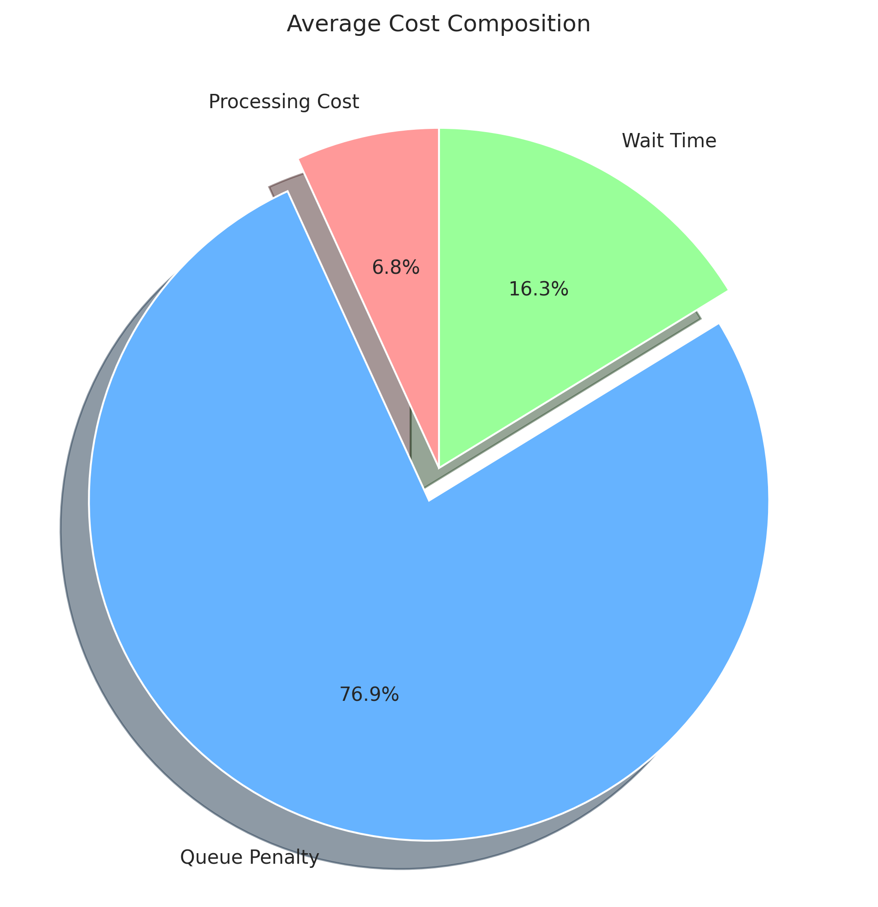
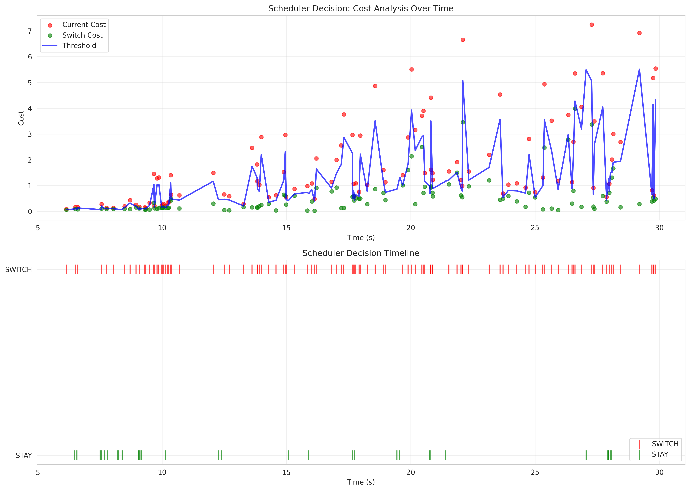
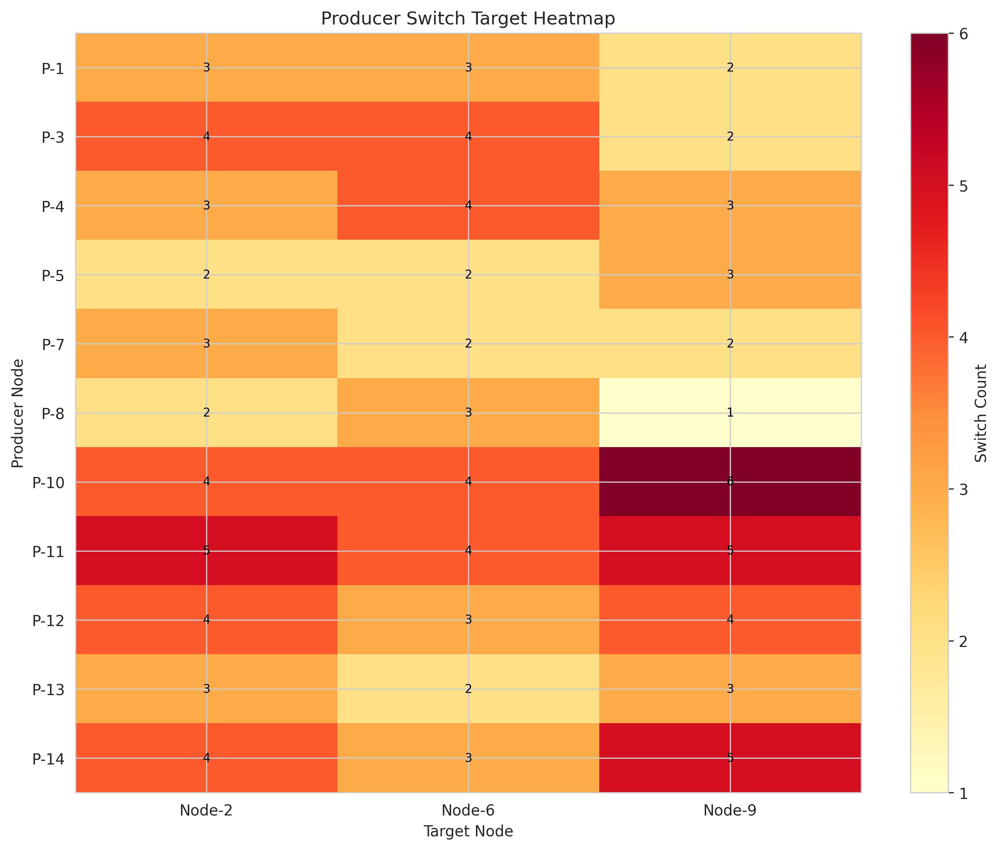
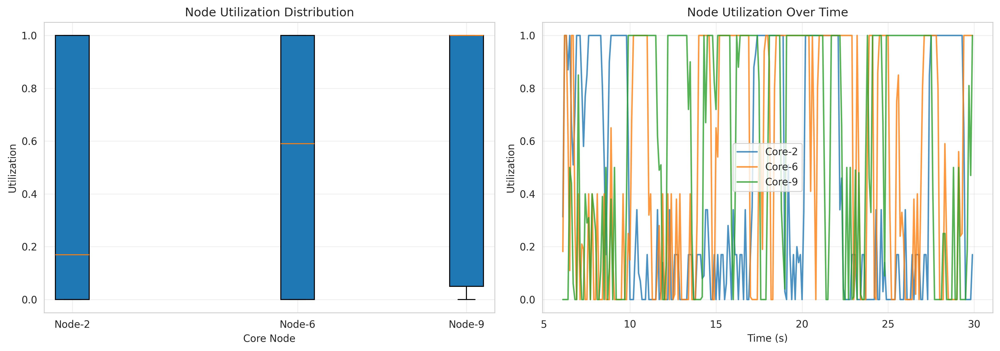

# 调度器仿真结果深度分析报告

*自动生成时间: 基于最新仿真结果*

---

## 执行摘要

本报告使用 **Polars** 数据分析库和 **Matplotlib** 可视化工具对 ns3-dsw 调度器仿真结果进行了定量分析。

**关键发现：**
- 调度器共做出 138 次决策，切换率为 77.5%
- 负载均衡度（标准差）: 0.0910
- 平均网络延迟: 24.00 ms
- 平均丢包率: 0.163%

---

## 1. 调度器决策分析

### 1.1 决策统计

| 指标 | 数值 |
|------|------|
| 总决策次数 | 138 |
| SWITCH 决策 | 107 (77.5%) |
| STAY 决策 | 31 (22.5%) |
| 平均当前成本 | 1.6308 |
| 平均切换成本 | 0.6355 |
| 平均阈值 | 1.2168 |

### 1.2 成本构成分析

- **处理成本**: 0.1329 (6.8%)
- **队列惩罚**: 1.4979 (76.9%)
- **等待时间**: 0.3165 (16.3%)

**分析**: 队列惩罚是主要成本来源，占总成本的 76.9%。这表明队列管理是影响调度决策的关键因素。

### 1.3 Producer 切换频率

| Producer | 总决策 | 切换次数 | 切换率 | 平均成本 |
|----------|--------|---------|--------|---------|
| Producer-11 | 15 | 14 | 93.3% | 1.7677 |
| Producer-10 | 16 | 14 | 87.5% | 1.8103 |
| Producer-14 | 16 | 12 | 75.0% | 1.4962 |
| Producer-12 | 13 | 11 | 84.6% | 1.9314 |
| Producer-3 | 13 | 10 | 76.9% | 1.1237 |
| Producer-4 | 13 | 10 | 76.9% | 1.9688 |
| Producer-1 | 19 | 8 | 42.1% | 1.8750 |
| Producer-13 | 8 | 8 | 100.0% | 1.9105 |
| Producer-5 | 12 | 7 | 58.3% | 1.5691 |
| Producer-7 | 7 | 7 | 100.0% | 0.6160 |

**观察**:
- 最活跃的 Producer: Producer-11 (14 次切换)
- 切换率差异显著，说明不同 Producer 的负载特征不同

---

## 2. 节点利用率分析

### 2.1 节点统计

| 节点 | 平均利用率 | 峰值 | 空闲时间占比 | 满载时间占比 | 标准差 |
|------|-----------|------|------------|------------|--------|
| Core-2 | 44.08% | 100.00% | 30.5% | 33.1% | 0.4368 |
| Core-6 | 55.17% | 100.00% | 29.3% | 43.9% | 0.4450 |
| Core-9 | 62.12% | 100.00% | 23.4% | 51.9% | 0.4351 |

### 2.2 负载均衡评估

**负载均衡度**: 0.0910

负载均衡度通过计算各节点平均利用率的标准差来衡量。数值越小表示负载分布越均衡。

- **0.0910 < 0.05**: 优秀的负载均衡
- **0.05 - 0.10**: 良好的负载均衡
- **> 0.10**: 存在负载倾斜

**结论**: 负载分布良好

---

## 3. 网络性能分析

### 3.1 整体性能指标

| 指标 | 数值 |
|------|------|
| 平均吞吐量 | 15.49 Mbps |
| 平均延迟 | 24.00 ms |
| 平均抖动 | 0.9101 ms |
| 平均丢包率 | 0.163% |
| 总流数 | 330 |

### 3.2 丢包分析

**检测到 70 个流存在丢包现象**

| Flow ID | 源地址 | 目标地址 | 发送包数 | 丢失包数 | 丢包率 |
|---------|--------|---------|---------|---------|--------|
| 89 | 10.0.2.1 | 10.0.9.2 | 2249 | 115 | 5.11% |
| 59 | 10.0.13.2 | 10.0.6.2 | 2253 | 63 | 2.80% |
| 67 | 10.0.11.1 | 10.0.6.2 | 2140 | 54 | 2.52% |
| 311 | 10.0.11.1 | 10.0.6.2 | 688 | 16 | 2.33% |
| 314 | 10.0.8.1 | 10.0.6.2 | 583 | 13 | 2.23% |

---

## 4. 关键发现与建议

### 4.1 优势

✅ **响应性强**: 调度器能够快速响应负载变化，切换率为 77.5%

✅ **负载均衡**: 三个计算节点的负载分布均衡度为 0.0910

✅ **网络性能**: 平均延迟仅 24.00 ms，丢包率 0.163%

### 4.2 潜在问题

⚠️ **频繁切换**: 部分 Producer 的切换率超过 70%，可能产生切换开销

⚠️ **队列压力**: 队列惩罚占总成本的 76.9%，是主要瓶颈

⚠️ **丢包风险**: 检测到 70 个流存在丢包，需要关注网络拥塞

### 4.3 优化建议

1. **引入切换冷却机制**: 限制单个 Producer 的切换频率，避免乒乓效应
2. **优化队列管理**: 实施主动队列管理（AQM）策略，提前疏导流量
3. **动态阈值调整**: 根据系统负载动态调整切换阈值
4. **预测性调度**: 引入负载预测算法，提前进行任务迁移

---

## 5. 数据文件

本分析基于以下数据文件：
- `scratch/ns3-dsw/out/scheduler_events.xml`
- `scratch/ns3-dsw/out/node_util.xml`
- `scratch/ns3-dsw/out/flowstats.csv`

生成的可视化图表：
- `scheduler_decision_analysis.png` - 调度决策时间序列分析
- `node_utilization_analysis.png` - 节点利用率对比
- `producer_switch_heatmap.png` - Producer 切换热力图
- `cost_composition.png` - 成本构成分析

---

*本报告由 Polars + Matplotlib 自动生成*
